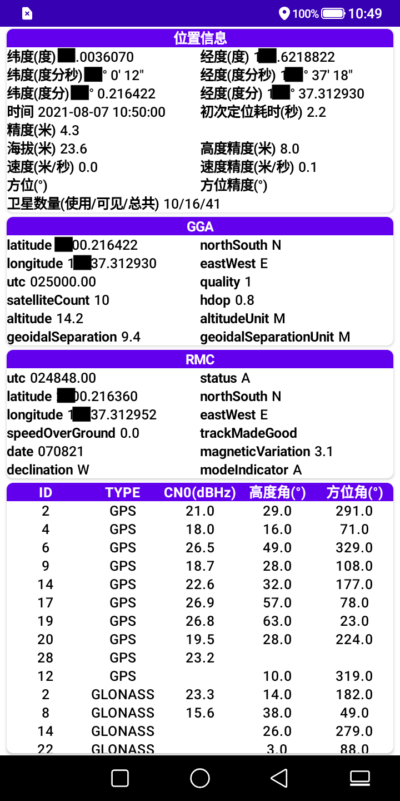

# ComposeLocation

### Introduction

Kotlin + JetPack Compose

A Test App for Global Navigation Satellite System (GNSS)

### ChangeLog

- v1.0.0: first version, Kotlin v1.5.21, Compose V1.0.1
- v1.0.1: fix Chinese translation error
- v1.1.0: add nmea GGA/RMC Information
- v1.1.1: 检测是否已经启动location Listener，避免重复添加回调
- v1.1.2: gps callback looper use HandlerThread
- v1.1.3: update gradle plugins and dependencies
- v1.2.0: update dependencies,信息通过tab分页显示
- v1.3.0: update dependencies and LocationHelper

### Screen Capture

